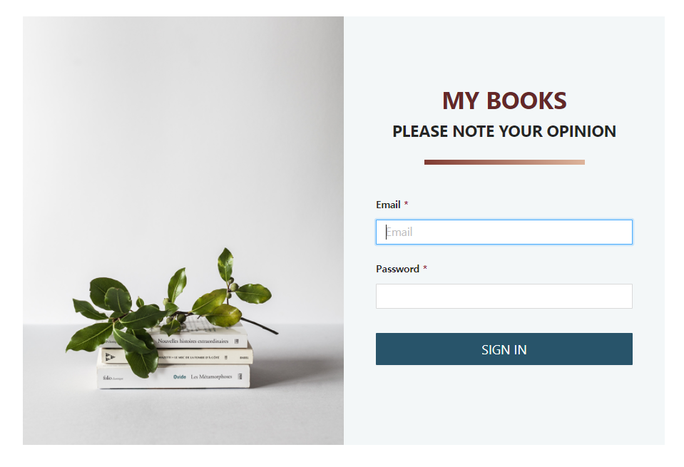
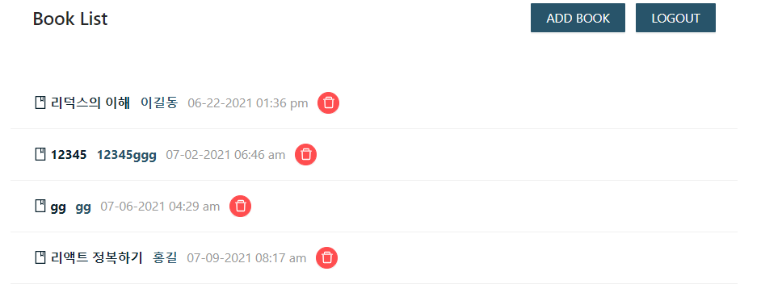
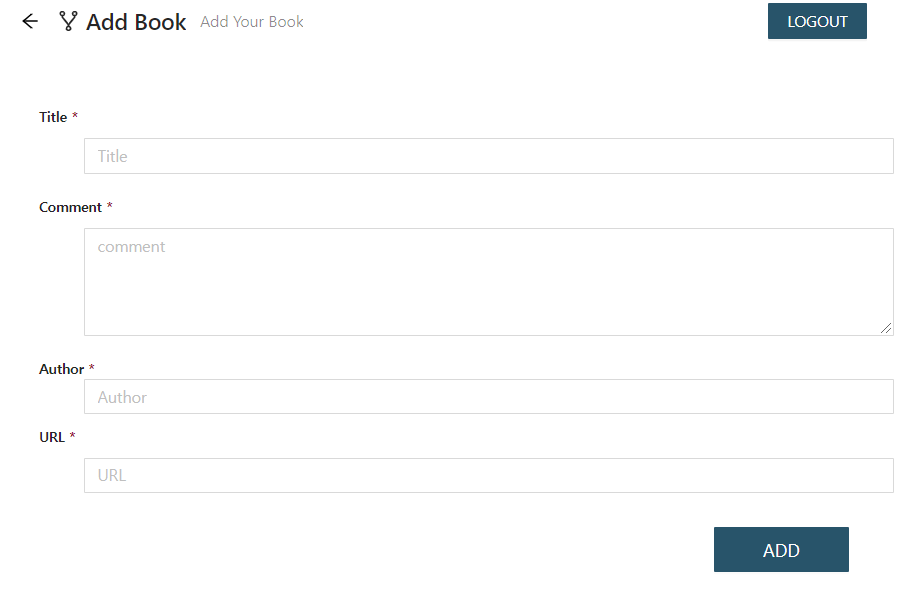

# 나만의 블로그

[사이트 바로가기](https://lucid-davinci-ab7bc7.netlify.app)

- 아이디 : mark@test.com
- 비밀번호 : fastcampus

## 💡 Specs

- redux
- react-router-dom
- redux-saga
- redux-acitons
- conntected-react-router
- Ant Design
- TypeScript
- Axios

# <기능 설명>

### 1. 로그인 페이지

<p align='center'>
  
</p>

- Component와 Container로 나눠서 Component는 View역할만, Container에 로직 작성
- Signin Component에 Props로 login 함수를 넘겨줘서 입력값을
  dispatch되는 Action에 인자로 넘겨줍니다.
- Success되면 Token을 만들어서 localstorage에 저장하고 로그인 상태를 관리 합니다.

```javascript
const dispatch = useDispatch();
const login = useCallback(
  (reqData) => {
    dispatch(loginSagaStart(reqData));
  },
  [dispatch]
);
```

### 2. 북 리스트 페이지

<p align='center'>
  
</p>

- 로그인과 같이 Props로 데이터를 가져오는 함수를 내려주고 useSelector라는 react-redux에서 제공하는 hook을 이용해서 Book Data도 Props로 내려주고 데이터를 뿌려줍니다.

```javascript
  const books = useSelector<RootState, BookType[] | null>(
    (state) => state.books.books
  );

  const loading = useSelector<RootState, boolean>(
    (state) => state.books.loading
  );
```

### 3. Add 북 페이지

<p align='center'>
  
</p>

- 위의 작업 내역과 유사한 내용

```javascript
function* addBookSaga(action: Action<BookReqType>) {
  try {
    yield put(pending());
    const token: string = yield select((state) => state.auth.token);
    const book: BookType = yield call(
      BookService.addBook,
      token,
      action.payload
    );
    const books: BookType[] = yield select((state) => state.books.books);
    yield put(success([...books, book]));
    yield put(push("/"));
  } catch (error) {
    yield put(fail(new Error(error?.response?.data?.error || "UNKNOW_ERROR")));
  }
}

function* deleteBookSaga(action: Action<number>) {
  try {
    const bookId = action.payload;
    yield put(pending());
    const token: string = yield select((state) => state.auth.token);
    yield call(BookService.deleteBook, token, bookId);
    const books: BookType[] = yield select((state) => state.books.books);
    yield put(success(books.filter((book) => book.bookId !== bookId)));
  } catch (error) {
    yield put(fail(new Error(error?.response?.data?.error || "UNKNOWN_ERROR")));
  }
}
```
